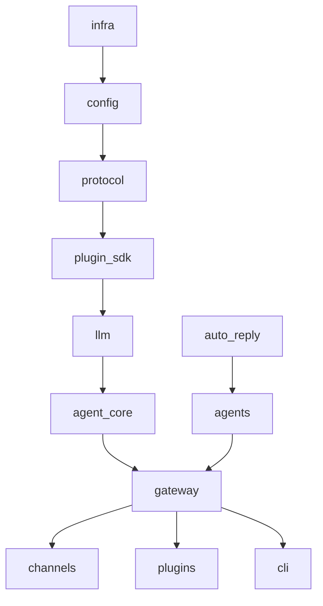

# OpenClaw TS → Python 迁移架构

> 源仓库：`/Users/liuchao/openclaw` (v2026.6.8)
> 目标仓库：`/Users/liuchao/openclaw-py`
> 生成时间：2026-06-19

## 规模

| 指标 | 数值 |
|------|------|
| TypeScript 文件 | ~16,431 |
| TypeScript 行数 | ~1,294,862 |
| extensions 插件 | ~147 |
| packages 子包 | 21 |

## 目标技术栈

| 维度 | TypeScript 原版 | Python 目标 |
|------|----------------|-------------|
| 运行时 | Node 22+ | Python 3.11+ |
| HTTP | Hono | FastAPI + uvicorn |
| CLI | 自研 argv | typer / click |
| 数据库 | SQLite + Kysely | SQLite + SQLAlchemy 2.0 |
| 测试 | Vitest | pytest |
| 包管理 | pnpm workspace | uv / hatchling monorepo |
| 异步 | Promise/async | asyncio |

## 分层架构（自底向上）

```
Layer 0: 基础设施
  - infra/ (env, logging, paths, process)
  - shared/ (types, utils)
  - config/ (openclaw.json schema, loader)

Layer 1: 协议与契约
  - packages/gateway-protocol → openclaw/protocol/
  - packages/plugin-package-contract → openclaw/plugin_contract/
  - packages/normalization-core → openclaw/normalization/

Layer 2: 核心包
  - packages/llm-core, llm-runtime → openclaw/llm/
  - packages/agent-core → openclaw/agent_core/
  - packages/gateway-client → openclaw/gateway_client/
  - src/plugin-sdk → openclaw/plugin_sdk/

Layer 3: 网关与 Agent 运行时
  - src/gateway/ (721 files) → openclaw/gateway/
  - src/agents/ (1809 files) → openclaw/agents/
  - src/auto-reply/ → openclaw/auto_reply/

Layer 4: 通道与插件
  - src/channels/ → openclaw/channels/
  - src/plugins/ → openclaw/plugins/
  - extensions/* → openclaw_extensions/* (按需移植)

Layer 5: CLI 与 UI
  - src/cli/, src/commands/ → openclaw/cli/
  - ui/ → 暂不移植（Web UI 后期用 FastAPI static 或独立前端）

Layer 6: 应用与技能
  - apps/ → 后期
  - skills/ → openclaw/skills/ (Skill 元数据 + 执行器)
```

## 迁移原则

1. **行为等价优先**：先复刻核心路径，再补边缘 case
2. **测试驱动**：每个模块迁移时同步移植对应 `*.test.ts` → `test_*.py`
3. **逐模块提交**：每完成一个 task 做一次 git commit
4. **不保留 TS 兼容层**：Python 版只读 canonical config shape
5. **插件延后**：核心 gateway + agent loop 跑通后再移植 extensions

## 模块依赖图（简化）



## 验收标准（MVP）

- [ ] `openclaw-py gateway start` 能启动 HTTP 网关
- [ ] `openclaw-py chat` 能通过 WebSocket/HTTP 收发消息
- [ ] Agent loop 能调用 LLM + MCP 工具
- [ ] Skill 系统能加载并执行 SKILL.md
- [ ] 本地文件读写工具可用
- [ ] 至少 1 个 channel stub（telegram 或 web）可用

## 目录对照

| TS 源路径 | Python 目标 |
|-----------|-------------|
| `src/infra/` | `openclaw/infra/` |
| `src/config/` | `openclaw/config/` |
| `packages/gateway-protocol/` | `openclaw/protocol/` |
| `src/gateway/` | `openclaw/gateway/` |
| `src/agents/` | `openclaw/agents/` |
| `src/plugin-sdk/` | `openclaw/plugin_sdk/` |
| `src/cli/` | `openclaw/cli/` |
| `src/channels/` | `openclaw/channels/` |
